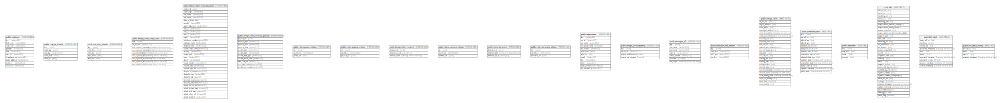

# postgres

## Tables

| Name | Columns | Comment | Type |
| ---- | ------- | ------- | ---- |
| [public.employee](public.employee.md) | 10 |  | FOREIGN TABLE |
| [public.emp_oe_relation](public.emp_oe_relation.md) | 5 |  | FOREIGN TABLE |
| [public.role_emp_relation](public.role_emp_relation.md) | 5 |  | FOREIGN TABLE |
| [public.foreign_claim_soap_status](public.foreign_claim_soap_status.md) | 9 |  | FOREIGN TABLE |
| [public.foreign_claim_involved_person](public.foreign_claim_involved_person.md) | 32 |  | FOREIGN TABLE |
| [public.foreign_claim_involved_property](public.foreign_claim_involved_property.md) | 11 |  | FOREIGN TABLE |
| [public.claim_person_relation](public.claim_person_relation.md) | 3 |  | FOREIGN TABLE |
| [public.claim_property_relation](public.claim_property_relation.md) | 3 |  | FOREIGN TABLE |
| [public.foreign_claim_comment](public.foreign_claim_comment.md) | 3 |  | FOREIGN TABLE |
| [public.claim_comment_relation](public.claim_comment_relation.md) | 3 |  | FOREIGN TABLE |
| [public.claim_document](public.claim_document.md) | 3 |  | FOREIGN TABLE |
| [public.claim_document_relation](public.claim_document_relation.md) | 3 |  | FOREIGN TABLE |
| [public.organisation](public.organisation.md) | 12 |  | FOREIGN TABLE |
| [public.foreign_claim_reporting](public.foreign_claim_reporting.md) | 4 |  | FOREIGN TABLE |
| [public.employee_v2](public.employee_v2.md) | 7 |  | FOREIGN TABLE |
| [public.employee_role_relation](public.employee_role_relation.md) | 4 |  | FOREIGN TABLE |
| [public.foreign_claim](public.foreign_claim.md) | 23 |  | BASE TABLE |
| [public.scheduled_task](public.scheduled_task.md) | 14 |  | BASE TABLE |
| [public.bookmark](public.bookmark.md) | 4 |  | BASE TABLE |
| [public.bill](public.bill.md) | 31 |  | BASE TABLE |
| [public.bill_batch](public.bill_batch.md) | 10 |  | BASE TABLE |
| [public.bill_status_history](public.bill_status_history.md) | 4 |  | BASE TABLE |

## Stored procedures and functions

| Name | ReturnType | Arguments | Type |
| ---- | ------- | ------- | ---- |
| public.postgres_fdw_handler | fdw_handler |  | FUNCTION |
| public.postgres_fdw_validator | void | text[], oid | FUNCTION |
| public.levenshtein | int4 | text, text | FUNCTION |
| public.levenshtein | int4 | text, text, integer, integer, integer | FUNCTION |
| public.levenshtein_less_equal | int4 | text, text, integer | FUNCTION |
| public.levenshtein_less_equal | int4 | text, text, integer, integer, integer, integer | FUNCTION |
| public.metaphone | text | text, integer | FUNCTION |
| public.soundex | text | text | FUNCTION |
| public.text_soundex | text | text | FUNCTION |
| public.difference | int4 | text, text | FUNCTION |
| public.dmetaphone | text | text | FUNCTION |
| public.dmetaphone_alt | text | text | FUNCTION |

## Relations

---

> Generated by [tbls](https://github.com/k1LoW/tbls)
