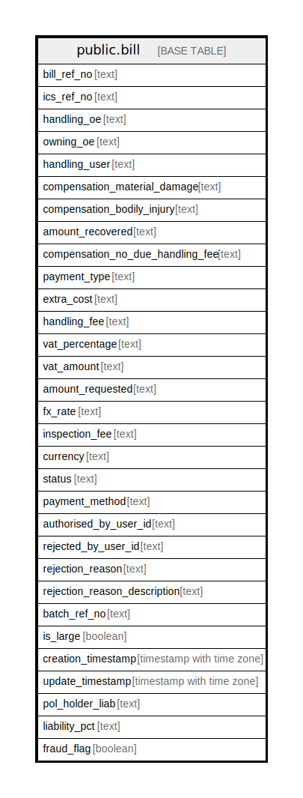

# public.bill

## Description

## Columns

| Name | Type | Default | Nullable | Children | Parents | Comment |
| ---- | ---- | ------- | -------- | -------- | ------- | ------- |
| bill_ref_no | text |  | true |  |  |  |
| ics_ref_no | text |  | true |  |  |  |
| handling_oe | text |  | true |  |  |  |
| owning_oe | text |  | true |  |  |  |
| handling_user | text |  | true |  |  |  |
| compensation_material_damage | text |  | true |  |  |  |
| compensation_bodily_injury | text |  | true |  |  |  |
| amount_recovered | text |  | true |  |  |  |
| compensation_no_due_handling_fee | text |  | true |  |  |  |
| payment_type | text |  | true |  |  |  |
| extra_cost | text |  | true |  |  |  |
| handling_fee | text |  | true |  |  |  |
| vat_percentage | text |  | true |  |  |  |
| vat_amount | text |  | true |  |  |  |
| amount_requested | text |  | true |  |  |  |
| fx_rate | text |  | true |  |  |  |
| inspection_fee | text |  | true |  |  |  |
| currency | text |  | true |  |  |  |
| status | text |  | true |  |  |  |
| payment_method | text |  | true |  |  |  |
| authorised_by_user_id | text |  | true |  |  |  |
| rejected_by_user_id | text |  | true |  |  |  |
| rejection_reason | text |  | true |  |  |  |
| rejection_reason_description | text |  | true |  |  |  |
| batch_ref_no | text |  | true |  |  |  |
| is_large | boolean |  | true |  |  |  |
| creation_timestamp | timestamp with time zone |  | true |  |  |  |
| update_timestamp | timestamp with time zone |  | true |  |  |  |
| pol_holder_liab | text |  | true |  |  |  |
| liability_pct | text |  | true |  |  |  |
| fraud_flag | boolean |  | true |  |  |  |

## Relations

---

> Generated by [tbls](https://github.com/k1LoW/tbls)
