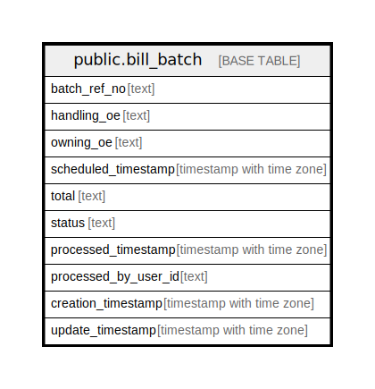

# public.bill_batch

## Description

## Columns

| Name | Type | Default | Nullable | Children | Parents | Comment |
| ---- | ---- | ------- | -------- | -------- | ------- | ------- |
| batch_ref_no | text |  | true |  |  |  |
| handling_oe | text |  | true |  |  |  |
| owning_oe | text |  | true |  |  |  |
| scheduled_timestamp | timestamp with time zone |  | true |  |  |  |
| total | text |  | true |  |  |  |
| status | text |  | true |  |  |  |
| processed_timestamp | timestamp with time zone |  | true |  |  |  |
| processed_by_user_id | text |  | true |  |  |  |
| creation_timestamp | timestamp with time zone |  | true |  |  |  |
| update_timestamp | timestamp with time zone |  | true |  |  |  |

## Relations

---

> Generated by [tbls](https://github.com/k1LoW/tbls)
