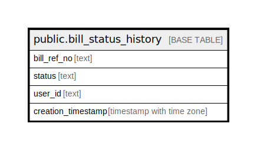

# public.bill_status_history

## Description

## Columns

| Name | Type | Default | Nullable | Children | Parents | Comment |
| ---- | ---- | ------- | -------- | -------- | ------- | ------- |
| bill_ref_no | text |  | false |  |  |  |
| status | text |  | false |  |  |  |
| user_id | text |  | true |  |  |  |
| creation_timestamp | timestamp with time zone |  | true |  |  |  |

## Constraints

| Name | Type | Definition |
| ---- | ---- | ---------- |
| bill_status_history_pkey | PRIMARY KEY | PRIMARY KEY (bill_ref_no, status) |

## Indexes

| Name | Definition |
| ---- | ---------- |
| bill_status_history_pkey | CREATE UNIQUE INDEX bill_status_history_pkey ON public.bill_status_history USING btree (bill_ref_no, status) |

## Relations

---

> Generated by [tbls](https://github.com/k1LoW/tbls)
