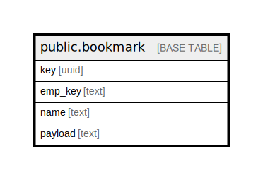

# public.bookmark

## Description

## Columns

| Name | Type | Default | Nullable | Children | Parents | Comment |
| ---- | ---- | ------- | -------- | -------- | ------- | ------- |
| key | uuid |  | false |  |  |  |
| emp_key | text |  | true |  |  |  |
| name | text |  | true |  |  |  |
| payload | text |  | true |  |  |  |

## Constraints

| Name | Type | Definition |
| ---- | ---- | ---------- |
| bookmark_pkey | PRIMARY KEY | PRIMARY KEY (key) |

## Indexes

| Name | Definition |
| ---- | ---------- |
| bookmark_pkey | CREATE UNIQUE INDEX bookmark_pkey ON public.bookmark USING btree (key) |
| idx_empkey_and_name | CREATE UNIQUE INDEX idx_empkey_and_name ON public.bookmark USING btree (emp_key, name) |

## Relations

---

> Generated by [tbls](https://github.com/k1LoW/tbls)
