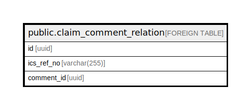

# public.claim_comment_relation

## Description

## Columns

| Name | Type | Default | Nullable | Children | Parents | Comment |
| ---- | ---- | ------- | -------- | -------- | ------- | ------- |
| id | uuid |  | false |  |  |  |
| ics_ref_no | varchar(255) |  | false |  |  |  |
| comment_id | uuid |  | false |  |  |  |

## Relations

---

> Generated by [tbls](https://github.com/k1LoW/tbls)
