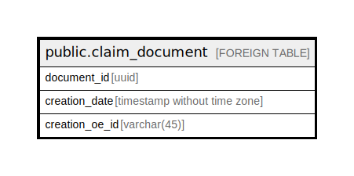

# public.claim_document

## Description

## Columns

| Name | Type | Default | Nullable | Children | Parents | Comment |
| ---- | ---- | ------- | -------- | -------- | ------- | ------- |
| document_id | uuid |  | false |  |  |  |
| creation_date | timestamp without time zone |  | true |  |  |  |
| creation_oe_id | varchar(45) |  | true |  |  |  |

## Relations

---

> Generated by [tbls](https://github.com/k1LoW/tbls)
