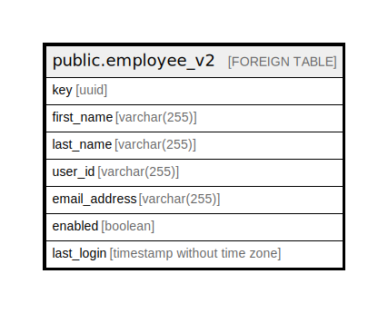

# public.employee_v2

## Description

## Columns

| Name | Type | Default | Nullable | Children | Parents | Comment |
| ---- | ---- | ------- | -------- | -------- | ------- | ------- |
| key | uuid |  | false |  |  |  |
| first_name | varchar(255) |  | false |  |  |  |
| last_name | varchar(255) |  | false |  |  |  |
| user_id | varchar(255) |  | false |  |  |  |
| email_address | varchar(255) |  | false |  |  |  |
| enabled | boolean |  | true |  |  |  |
| last_login | timestamp without time zone |  | true |  |  |  |

## Relations

---

> Generated by [tbls](https://github.com/k1LoW/tbls)
