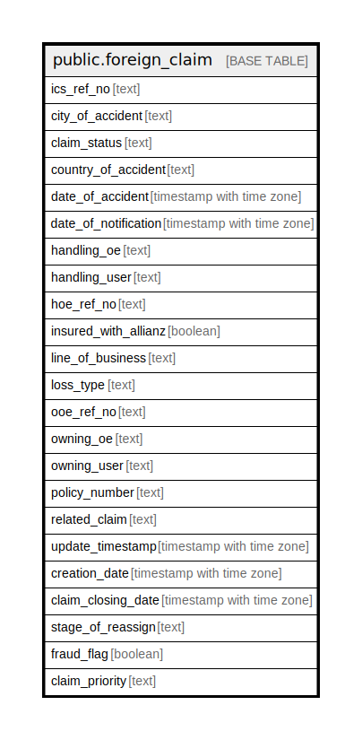

# public.foreign_claim

## Description

## Columns

| Name | Type | Default | Nullable | Children | Parents | Comment |
| ---- | ---- | ------- | -------- | -------- | ------- | ------- |
| ics_ref_no | text |  | false |  |  |  |
| city_of_accident | text |  | true |  |  |  |
| claim_status | text |  | true |  |  |  |
| country_of_accident | text |  | true |  |  |  |
| date_of_accident | timestamp with time zone |  | true |  |  |  |
| date_of_notification | timestamp with time zone |  | true |  |  |  |
| handling_oe | text |  | true |  |  |  |
| handling_user | text |  | true |  |  |  |
| hoe_ref_no | text |  | true |  |  |  |
| insured_with_allianz | boolean |  | true |  |  |  |
| line_of_business | text |  | true |  |  |  |
| loss_type | text |  | true |  |  |  |
| ooe_ref_no | text |  | true |  |  |  |
| owning_oe | text |  | true |  |  |  |
| owning_user | text |  | true |  |  |  |
| policy_number | text |  | true |  |  |  |
| related_claim | text |  | true |  |  |  |
| update_timestamp | timestamp with time zone |  | true |  |  |  |
| creation_date | timestamp with time zone |  | true |  |  |  |
| claim_closing_date | timestamp with time zone |  | true |  |  |  |
| stage_of_reassign | text |  | true |  |  |  |
| fraud_flag | boolean |  | true |  |  |  |
| claim_priority | text |  | true |  |  |  |

## Constraints

| Name | Type | Definition |
| ---- | ---- | ---------- |
| foreign_claim_pkey | PRIMARY KEY | PRIMARY KEY (ics_ref_no) |

## Indexes

| Name | Definition |
| ---- | ---------- |
| foreign_claim_pkey | CREATE UNIQUE INDEX foreign_claim_pkey ON public.foreign_claim USING btree (ics_ref_no) |

## Relations

---

> Generated by [tbls](https://github.com/k1LoW/tbls)
