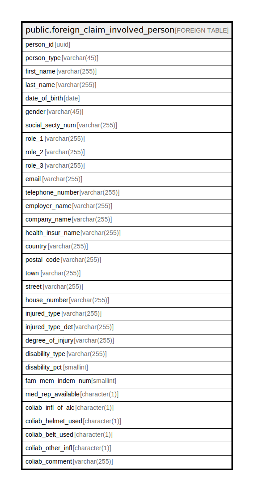

# public.foreign_claim_involved_person

## Description

## Columns

| Name | Type | Default | Nullable | Children | Parents | Comment |
| ---- | ---- | ------- | -------- | -------- | ------- | ------- |
| person_id | uuid |  | false |  |  |  |
| person_type | varchar(45) |  | true |  |  |  |
| first_name | varchar(255) |  | true |  |  |  |
| last_name | varchar(255) |  | true |  |  |  |
| date_of_birth | date |  | true |  |  |  |
| gender | varchar(45) |  | true |  |  |  |
| social_secty_num | varchar(255) |  | true |  |  |  |
| role_1 | varchar(255) |  | true |  |  |  |
| role_2 | varchar(255) |  | true |  |  |  |
| role_3 | varchar(255) |  | true |  |  |  |
| email | varchar(255) |  | true |  |  |  |
| telephone_number | varchar(255) |  | true |  |  |  |
| employer_name | varchar(255) |  | true |  |  |  |
| company_name | varchar(255) |  | true |  |  |  |
| health_insur_name | varchar(255) |  | true |  |  |  |
| country | varchar(255) |  | true |  |  |  |
| postal_code | varchar(255) |  | true |  |  |  |
| town | varchar(255) |  | true |  |  |  |
| street | varchar(255) |  | true |  |  |  |
| house_number | varchar(255) |  | true |  |  |  |
| injured_type | varchar(255) |  | true |  |  |  |
| injured_type_det | varchar(255) |  | true |  |  |  |
| degree_of_injury | varchar(255) |  | true |  |  |  |
| disability_type | varchar(255) |  | true |  |  |  |
| disability_pct | smallint |  | true |  |  |  |
| fam_mem_indem_num | smallint |  | true |  |  |  |
| med_rep_available | character(1) |  | true |  |  |  |
| coliab_infl_of_alc | character(1) |  | true |  |  |  |
| coliab_helmet_used | character(1) |  | true |  |  |  |
| coliab_belt_used | character(1) |  | true |  |  |  |
| coliab_other_infl | character(1) |  | true |  |  |  |
| coliab_comment | varchar(255) |  | true |  |  |  |

## Relations

---

> Generated by [tbls](https://github.com/k1LoW/tbls)
