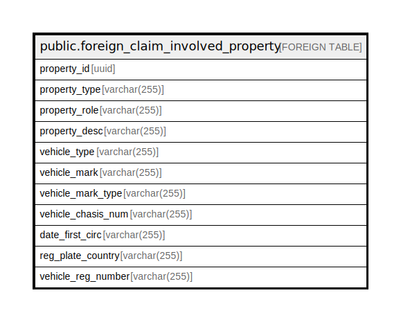

# public.foreign_claim_involved_property

## Description

## Columns

| Name | Type | Default | Nullable | Children | Parents | Comment |
| ---- | ---- | ------- | -------- | -------- | ------- | ------- |
| property_id | uuid |  | false |  |  |  |
| property_type | varchar(255) |  | true |  |  |  |
| property_role | varchar(255) |  | true |  |  |  |
| property_desc | varchar(255) |  | true |  |  |  |
| vehicle_type | varchar(255) |  | true |  |  |  |
| vehicle_mark | varchar(255) |  | true |  |  |  |
| vehicle_mark_type | varchar(255) |  | true |  |  |  |
| vehicle_chasis_num | varchar(255) |  | true |  |  |  |
| date_first_circ | varchar(255) |  | true |  |  |  |
| reg_plate_country | varchar(255) |  | true |  |  |  |
| vehicle_reg_number | varchar(255) |  | true |  |  |  |

## Relations

---

> Generated by [tbls](https://github.com/k1LoW/tbls)
