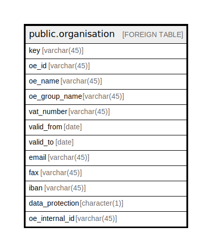

# public.organisation

## Description

## Columns

| Name | Type | Default | Nullable | Children | Parents | Comment |
| ---- | ---- | ------- | -------- | -------- | ------- | ------- |
| key | varchar(45) |  | false |  |  |  |
| oe_id | varchar(45) |  | false |  |  |  |
| oe_name | varchar(45) |  | false |  |  |  |
| oe_group_name | varchar(45) |  | false |  |  |  |
| vat_number | varchar(45) |  | false |  |  |  |
| valid_from | date |  | false |  |  |  |
| valid_to | date |  | false |  |  |  |
| email | varchar(45) |  | false |  |  |  |
| fax | varchar(45) |  | false |  |  |  |
| iban | varchar(45) |  | false |  |  |  |
| data_protection | character(1) |  | false |  |  |  |
| oe_internal_id | varchar(45) |  | true |  |  |  |

## Relations

---

> Generated by [tbls](https://github.com/k1LoW/tbls)
