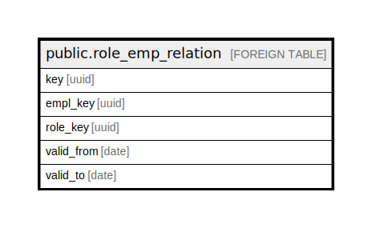

# public.role_emp_relation

## Description

## Columns

| Name | Type | Default | Nullable | Children | Parents | Comment |
| ---- | ---- | ------- | -------- | -------- | ------- | ------- |
| key | uuid |  | false |  |  |  |
| empl_key | uuid |  | false |  |  |  |
| role_key | uuid |  | false |  |  |  |
| valid_from | date |  | false |  |  |  |
| valid_to | date |  | false |  |  |  |

## Relations

---

> Generated by [tbls](https://github.com/k1LoW/tbls)
