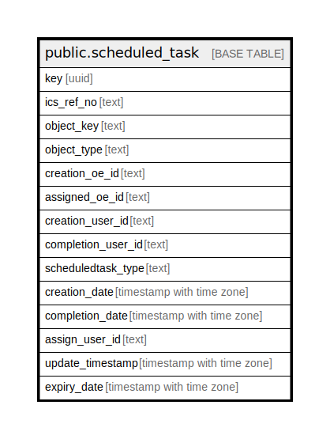

# public.scheduled_task

## Description

## Columns

| Name | Type | Default | Nullable | Children | Parents | Comment |
| ---- | ---- | ------- | -------- | -------- | ------- | ------- |
| key | uuid |  | false |  |  |  |
| ics_ref_no | text |  | true |  |  |  |
| object_key | text |  | true |  |  |  |
| object_type | text |  | true |  |  |  |
| creation_oe_id | text |  | true |  |  |  |
| assigned_oe_id | text |  | true |  |  |  |
| creation_user_id | text |  | true |  |  |  |
| completion_user_id | text |  | true |  |  |  |
| scheduledtask_type | text |  | true |  |  |  |
| creation_date | timestamp with time zone |  | true |  |  |  |
| completion_date | timestamp with time zone |  | true |  |  |  |
| assign_user_id | text |  | true |  |  |  |
| update_timestamp | timestamp with time zone |  | true |  |  |  |
| expiry_date | timestamp with time zone |  | true |  |  |  |

## Constraints

| Name | Type | Definition |
| ---- | ---- | ---------- |
| scheduled_task_pkey | PRIMARY KEY | PRIMARY KEY (key) |

## Indexes

| Name | Definition |
| ---- | ---------- |
| scheduled_task_pkey | CREATE UNIQUE INDEX scheduled_task_pkey ON public.scheduled_task USING btree (key) |

## Relations

---

> Generated by [tbls](https://github.com/k1LoW/tbls)
