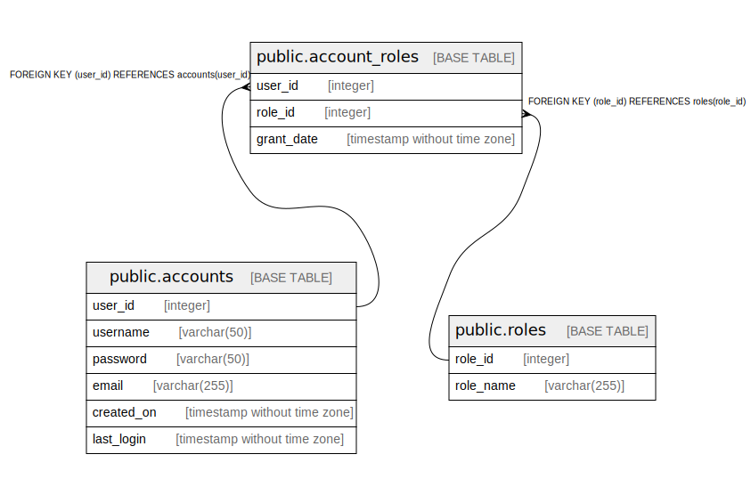

# postgres

## Tables

| Name | Columns | Comment | Type |
| ---- | ------- | ------- | ---- |
| [public.accounts](public.accounts.md) | 6 |  | BASE TABLE |
| [public.roles](public.roles.md) | 2 |  | BASE TABLE |
| [public.account_roles](public.account_roles.md) | 3 |  | BASE TABLE |

## Relations

---

> Generated by [tbls](https://github.com/k1LoW/tbls)
