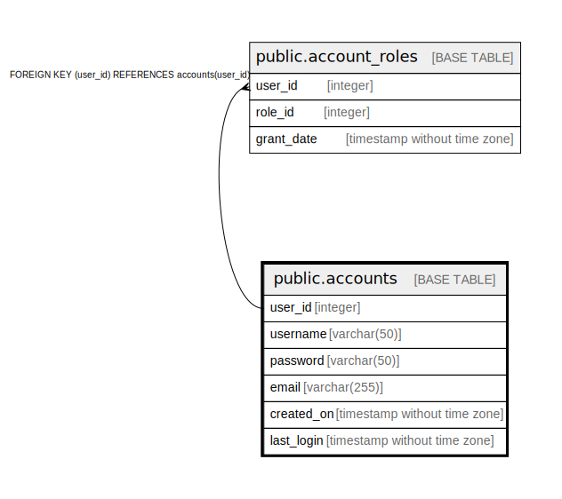

# public.accounts

## Description

Keep the basic informations

## Columns

| Name | Type | Default | Nullable | Children | Parents | Comment |
| ---- | ---- | ------- | -------- | -------- | ------- | ------- |
| user_id | integer | nextval('accounts_user_id_seq'::regclass) | false | [public.account_roles](public.account_roles.md) |  |  |
| username | varchar(50) |  | false |  |  |  |
| password | varchar(50) |  | false |  |  |  |
| email | varchar(255) |  | false |  |  |  |
| created_on | timestamp without time zone |  | false |  |  |  |
| last_login | timestamp without time zone |  | true |  |  |  |

## Constraints

| Name | Type | Definition |
| ---- | ---- | ---------- |
| accounts_pkey | PRIMARY KEY | PRIMARY KEY (user_id) |
| accounts_username_key | UNIQUE | UNIQUE (username) |
| accounts_email_key | UNIQUE | UNIQUE (email) |

## Indexes

| Name | Definition |
| ---- | ---------- |
| accounts_pkey | CREATE UNIQUE INDEX accounts_pkey ON public.accounts USING btree (user_id) |
| accounts_username_key | CREATE UNIQUE INDEX accounts_username_key ON public.accounts USING btree (username) |
| accounts_email_key | CREATE UNIQUE INDEX accounts_email_key ON public.accounts USING btree (email) |

## Relations

---

> Generated by [tbls](https://github.com/k1LoW/tbls)
