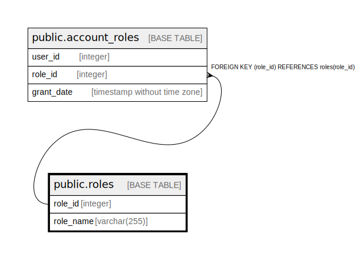

# public.roles

## Description

## Columns

| Name | Type | Default | Nullable | Children | Parents | Comment |
| ---- | ---- | ------- | -------- | -------- | ------- | ------- |
| role_id | integer | nextval('roles_role_id_seq'::regclass) | false | [public.account_roles](public.account_roles.md) |  |  |
| role_name | varchar(255) |  | false |  |  |  |

## Constraints

| Name | Type | Definition |
| ---- | ---- | ---------- |
| roles_pkey | PRIMARY KEY | PRIMARY KEY (role_id) |
| roles_role_name_key | UNIQUE | UNIQUE (role_name) |

## Indexes

| Name | Definition |
| ---- | ---------- |
| roles_pkey | CREATE UNIQUE INDEX roles_pkey ON public.roles USING btree (role_id) |
| roles_role_name_key | CREATE UNIQUE INDEX roles_role_name_key ON public.roles USING btree (role_name) |

## Relations

---

> Generated by [tbls](https://github.com/k1LoW/tbls)
